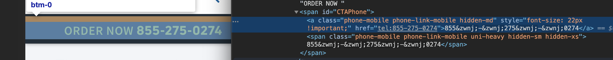

# zwnj-seek-and-destroy
Created for websites that have hidden, non-printable characters specifically zero-width non-join characters &amp;zwnj;.  Modifications will need to be made to the script should you want to replace anything other than zero-width character.  Just paste in what you want to `seek and destroy`.

## Example
An example website includes:  https://www.exede.com/
Where they have:



## How to Run
  1.  Pull the script down.
  2.  Copy and paste in the console of a website you want to see it's impact.
  3.  The last few lines of the script have some commented lines for `main()` and a `_clock_performance()`.  Pick which you want to run.  If you are running main(), just uncomment it.  If you want to run the performance wrapper fn(), then uncomment that.  You can run several times back-to-back in the console just by invoking `_clock_performance()` over and over again.  See below for an example of this.
  
## Performance
On a modern desktop these were the results from the last few runs:

```
_clock_performance()
VM5337:36 This is how long it takes to strip the invisible chars ~: 5.835205078125ms
VM5337:36 This is how long it takes to add back the invisible chars ~: 0.504150390625ms
undefined
_clock_performance()
VM5337:36 This is how long it takes to strip the invisible chars ~: 3.42529296875ms
VM5337:36 This is how long it takes to add back the invisible chars ~: 0.375ms
undefined
_clock_performance()
VM5337:36 This is how long it takes to strip the invisible chars ~: 3.2470703125ms
VM5337:36 This is how long it takes to add back the invisible chars ~: 0.300048828125ms
undefined
_clock_performance()
VM5337:36 This is how long it takes to strip the invisible chars ~: 3.927001953125ms
VM5337:36 This is how long it takes to add back the invisible chars ~: 0.247802734375ms
```
